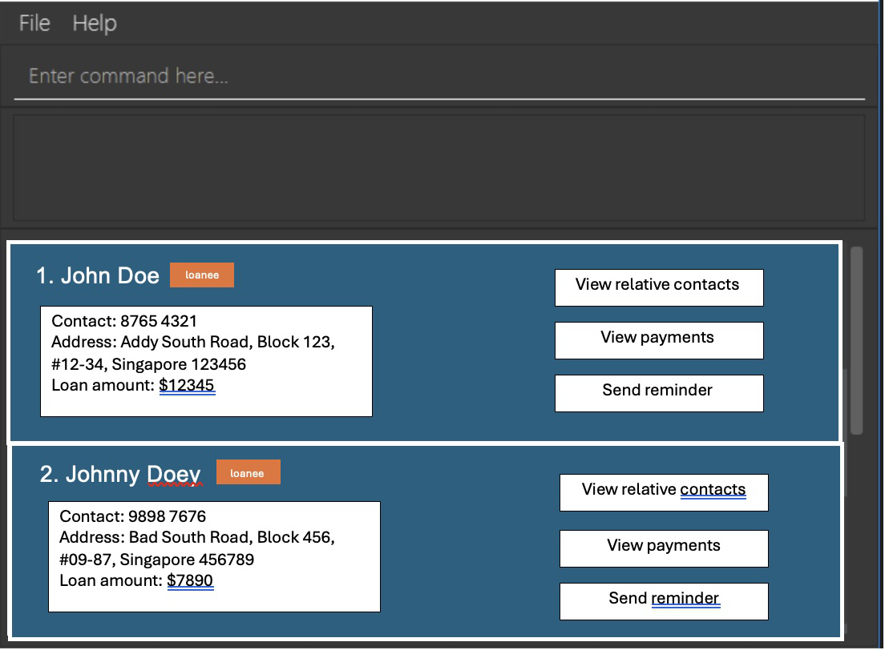

# The Sharkives

*The Sharkives* is a **desktop application for ethical, non-violent loansharks**.

Managing clients, tracking debts, and sending payment reminders has never been easier. With automatic interest calculations and well-organized client details, you can stay on top of your business while maintaining professionalism. Whether it's grouping related contacts, scheduling follow-ups, or ensuring accurate repayment tracking, *The Sharkives* streamlines the entire process—so you can focus on what matters.

## Features

- **Contact Management**: Store and organise client contact details, along with their related addresses and connections.
- **Loan Tracking**: Automatically calculate the amount a client owes based on the given interest rate and loan type (simple or compound interest).
- **Payment Reminder**: Send reminders to clients based on their due dates and outstanding balances.
- **Organised Client Information**: Group the addresses and contacts of people related to the loanee, facilitating better follow-ups.

## About

*The Sharkives* is written in **Object-Oriented Programming (OOP) fashion** and provides a **structured, well-documented** codebase.
It serves as a **realistic software project** for SE students, offering a codebase of moderate size (~6 KLoC) that balances complexity and maintainability.
This project was originally based on 'AddressBook Level 3' ('AB3') but has been modified and extended for loan tracking.

* For the detailed documentation of this project, see the **[Address Book Product Website](https://se-education.org/addressbook-level3)**.
* This project is a **part of the se-education.org** initiative. If you would like to contribute code to this project, see [se-education.org](https://se-education.org/#contributing-to-se-edu) for more info.
