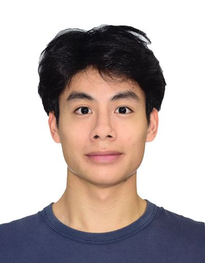

# About Us

We are a team based in the [School of Computing, National University of Singapore](http://www.comp.nus.edu.sg).

You can reach us at the email `seer[at]comp.nus.edu.sg`

## Project team

### Alexander Oh

[[github](https://github.com/alexandtheoh)]
[[portfolio](https://www.linkedin.com/in/alexander-oh-zj/)]

* Role: Project Advisor

### Zhao Wenrui

[[github](https://github.com/wenruu/)]
[[portfolio](https://www.linkedin.com/in/zhao-wenrui-47208131a/)]

* Role: Developer

### Zechary

[[github](http://github.com/johndoe)] [[portfolio](team/johndoe.md)]

* Role: Developer
* Responsibilities: Data

### Ang Jo Zee

[[github](http://github.com/angjozee)]
[[portfolio](team/johndoe.md)]

* Role: Developer
* Responsibilities: Dev Ops + Threading

### Nandita Selvaraju

[[github](http://github.com/nanditaselvaraju)]
[[portfolio](team/johndoe.md)]

* Role: Developer
* Responsibilities: UI
