# The Sharkives Developer Guide

<!-- * Table of Contents -->
# Table of Contents

1. [Acknowledgements](#acknowledgements)
2. [Setting up, getting started](#setting-up-getting-started)
3. [Design](#design)
    - [Architecture](#architecture)
    - [UI component](#ui-component)
    - [Logic component](#logic-component)
    - [Model component](#model-component)
    - [Storage component](#storage-component)
    - [Common classes](#common-classes)
4. [Implementation](#implementation)
    - [Add loan feature](#add-loan-feature)
    - [Payment feature](#payment-feature)
5. [Documentation, logging, testing, configuration, dev-ops](#documentation-logging-testing-configuration-dev-ops)
6. [Appendix: Requirements](#appendix-requirements)
    - [Product scope](#product-scope)
    - [User stories](#user-stories)
    - [Use cases](#use-cases)
    - [Non-Functional Requirements](#non-functional-requirements)
    - [Glossary](#glossary)
7. [Appendix: Instructions for Manual Testing](#appendix-instructions-for-manual-testing)
8. [Appendix: Effort](#appendix-effort)

<page-nav-print />

--------------------------------------------------------------------------------------------------------------------

## **Acknowledgements**

- [SE-Education's AddressBook Level-3](https://se-education.org/AddressBook-level3/), upon which this is built on.

--------------------------------------------------------------------------------------------------------------------

## **Setting up, getting started**

Refer to the guide [_Setting up and getting started_](SettingUp.md).

--------------------------------------------------------------------------------------------------------------------

## **Design**

### Architecture

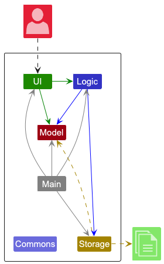

The ***Architecture Diagram*** given above explains the high-level design of the App.

Given below is a quick overview of main components and how they interact with each other.

**Main components of the architecture**

**`Main`** (consisting of classes [`Main`](https://github.com/AY2425S2-CS2103T-T14-2/tp/blob/master/src/main/java/seedu/address/Main.java) and [`MainApp`](https://github.com/AY2425S2-CS2103T-T14-2/tp/blob/master/src/main/java/seedu/address/MainApp.java)) is in charge of the app launch and shut down.
* At app launch, it initializes the other components in the correct sequence, and connects them up with each other.
* At shut down, it shuts down the other components and invokes cleanup methods where necessary.

The bulk of the app's work is done by the following four components:

* [**`UI`**](#ui-component): The UI of the App.
* [**`Logic`**](#logic-component): The command executor.
* [**`Model`**](#model-component): Holds the data of the App in memory.
* [**`Storage`**](#storage-component): Reads data from, and writes data to, the hard disk.

[**`Commons`**](#common-classes) represents a collection of classes used by multiple other components.

**How the architecture components interact with each other**

The *Sequence Diagram* below shows how the components interact with each other for the scenario where the user issues the command `delete 1`.

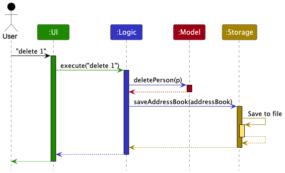

Each of the four main components (also shown in the diagram above),

* defines its *API* in an `interface` with the same name as the Component.
* implements its functionality using a concrete `{Component Name}Manager` class (which follows the corresponding API `interface` mentioned in the previous point.

For example, the `Logic` component defines its API in the `Logic.java` interface and implements its functionality using the `LogicManager.java` class which follows the `Logic` interface. Other components interact with a given component through its interface rather than the concrete class (reason: to prevent outside component's being coupled to the implementation of a component), as illustrated in the (partial) class diagram below.

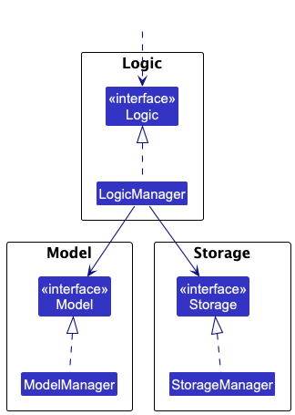

The sections below give more details of each component.

### UI component

The **API** of this component is specified in [`Ui.java`](https://github.com/AY2425S2-CS2103T-T14-2/tp/blob/master/src/main/java/seedu/address/ui/Ui.java)

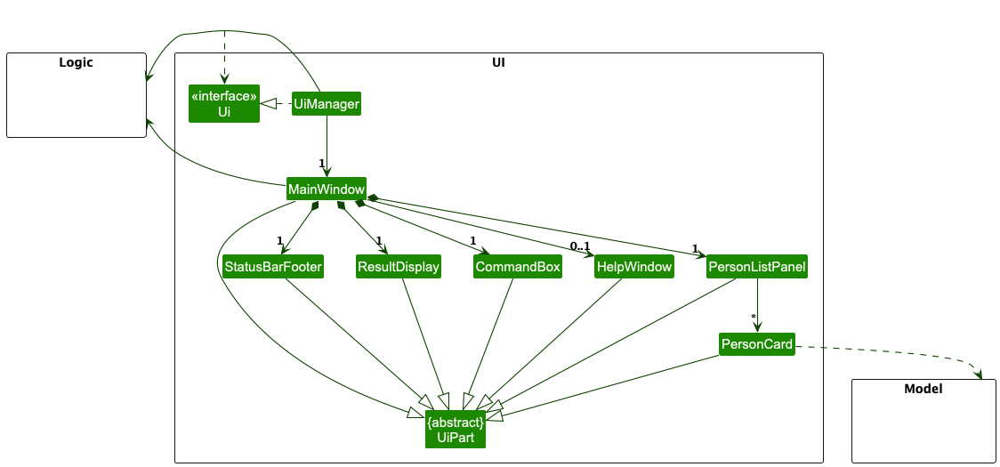

The UI consists of a `MainWindow` that is made up of parts e.g.`CommandBox`, `ResultDisplay`, `PersonListPanel`, `StatusBarFooter` etc. All these, including the `MainWindow`, inherit from the abstract `UiPart` class which captures the commonalities between classes that represent parts of the visible GUI.

The `UI` component uses the JavaFx UI framework. The layout of these UI parts are defined in matching `.fxml` files that are in the `src/main/resources/view` folder. For example, the layout of the [`MainWindow`](https://github.com/AY2425S2-CS2103T-T14-2/tp/blob/master/src/main/java/seedu/address/ui/MainWindow.java) is specified in [`MainWindow.fxml`](https://github.com/AY2425S2-CS2103T-T14-2/tp/blob/master/src/main/resources/view/MainWindow.fxml)

The `UI` component,

* executes user commands using the `Logic` component.
* listens for changes to `Model` data so that the UI can be updated with the modified data.
* keeps a reference to the `Logic` component, because the `UI` relies on the `Logic` to execute commands.
* depends on some classes in the `Model` component, as it displays `Person` object residing in the `Model`.

### Logic component

**API** : [`Logic.java`](https://github.com/AY2425S2-CS2103T-T14-2/tp/blob/master/src/main/java/seedu/address/logic/Logic.java)

Here's a (partial) class diagram of the `Logic` component:

The sequence diagram below illustrates the interactions within the `Logic` component, taking `execute("delete 1")` API call as an example.

<box type="info" seamless>

**Note:** The lifeline for `DeleteCommandParser` should end at the destroy marker (X) but due to a limitation of PlantUML, the lifeline continues till the end of diagram.
</box>

How the `Logic` component works:

1. When `Logic` is called upon to execute a command, it is passed to an `AddressBookParser` object which in turn creates a parser that matches the command (e.g., `DeleteCommandParser`) and uses it to parse the command.
1. This results in a `Command` object (more precisely, an object of one of its subclasses e.g., `DeleteCommand`) which is executed by the `LogicManager`.
1. The command can communicate with the `Model` when it is executed (e.g. to delete a client). 
   Note that although this is shown as a single step in the diagram above (for simplicity), in the code it can take several interactions (between the command object and the `Model`) to achieve.
1. The result of the command execution is encapsulated as a `CommandResult` object which is returned back from `Logic`.

Here are the other classes in `Logic` (omitted from the class diagram above) that are used for parsing a user command:

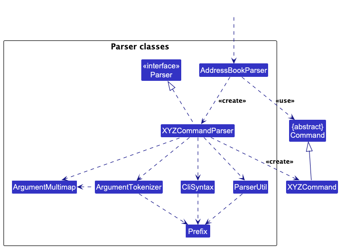

How the parsing works:
* When called upon to parse a user command, the `AddressBookParser` class creates an `XYZCommandParser` (`XYZ` is a placeholder for the specific command name e.g., `AddCommandParser`) which uses the other classes shown above to parse the user command and create a `XYZCommand` object (e.g., `AddCommand`) which the `AddressBookParser` returns back as a `Command` object.
* All `XYZCommandParser` classes (e.g., `AddCommandParser`, `DeleteCommandParser`, ...) inherit from the `Parser` interface so that they can be treated similarly where possible e.g, during testing.

The following classes were added to support new commands:

- `PayCommand` and `PayCommandParser`
- `SortCommand` and `SortCommandParser`
- `FilterLoanCommand` and `FilterLoanCommandParser`
- `DeleteLoanCommand`, with `DeleteCommandParser` updated to return either a `DeleteCommand` or `DeleteLoanCommand`

Each new command follows the Command design pattern and extends the abstract `Command` class.

### Model component
**API** : [`Model.java`](https://github.com/AY2425S2-CS2103T-T14-2/tp/blob/master/src/main/java/seedu/address/model/Model.java)

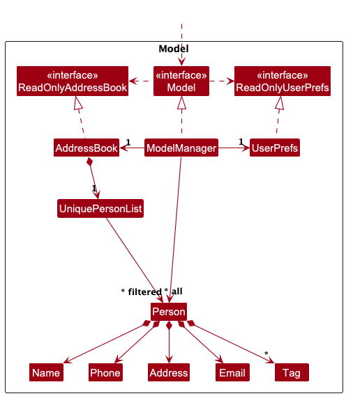

The `Model` component,

* stores the address book data i.e., all `Person` objects (which are contained in a `UniquePersonList` object).
* stores the currently 'selected' `Person` objects (e.g., results of a search query) as a separate _filtered_ list which is exposed to outsiders as an unmodifiable `ObservableList<Person>` that can be 'observed' e.g. the UI can be bound to this list so that the UI automatically updates when the data in the list change.
* stores a `UserPref` object that represents the user’s preferences. This is exposed to the outside as a `ReadOnlyUserPref` objects.
* does not depend on any of the other three components (as the `Model` represents data entities of the domain, they should make sense on their own without depending on other components)

<box type="info" seamless>

**Note:** An alternative (arguably, a more OOP) model is given below. It has a `Tag` list in the `The Sharkives`, which `Person` references. This allows `The Sharkives` to only require one `Tag` object per unique tag, instead of each `Person` needing their own `Tag` objects. 

</box>

### Storage component

**API** : [`Storage.java`](https://github.com/AY2425S2-CS2103T-T14-2/tp/blob/master/src/main/java/seedu/address/storage/Storage.java)

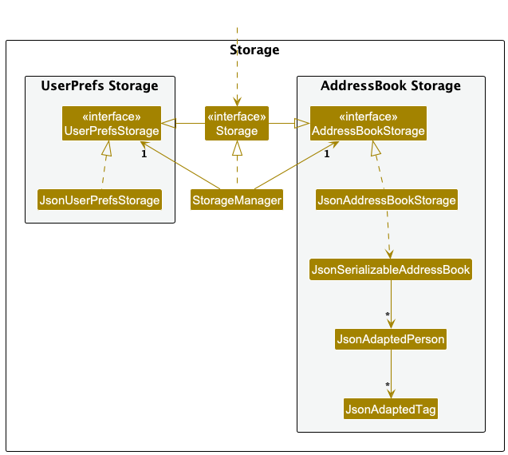

The `Storage` component,
* can save both address book data and user preference data in JSON format, and read them back into corresponding objects.
* inherits from both `AddressBookStorage` and `UserPrefStorage`, which means it can be treated as either one (if only the functionality of only one is needed).
* depends on some classes in the `Model` component (because the `Storage` component's job is to save/retrieve objects that belong to the `Model`)

### Common classes

Classes used by multiple components are in the `seedu.address.commons` package.

--------------------------------------------------------------------------------------------------------------------

## **Implementation**

This section describes some noteworthy details on how certain features are implemented.

### Add loan feature

#### Implementation

The `loan` feature is facilitated by `Loanlist`, which contains an `ArrayList<Loan>` that stores the loan list, along with several related methods. Each `Person` has a `LoanList`, which contains the loans that have been made to them. Thus, the following classes were created:
- `Loan`  —  an abstract class that dictates what a `Loan` class should do and contain.
- `SimpleInterestLoan` and `CompoundInterestLoan`, each representing their respective loan type, with different calculations for interest and amount owed.
- `LoanCommandParser`, which implements `Parser`. It is passed the arguments from a `loan` command by the Ui, and in turn generates a `LoanCommand` object.
- `LoanCommand`  — , which inherits from `Command`. When executed, it creates a new loan based on the arguments (if they are all valid), and adds it to the `LoanList` of a specified `Person`.

Below is the class diagram showing `Loan` and its child classes:

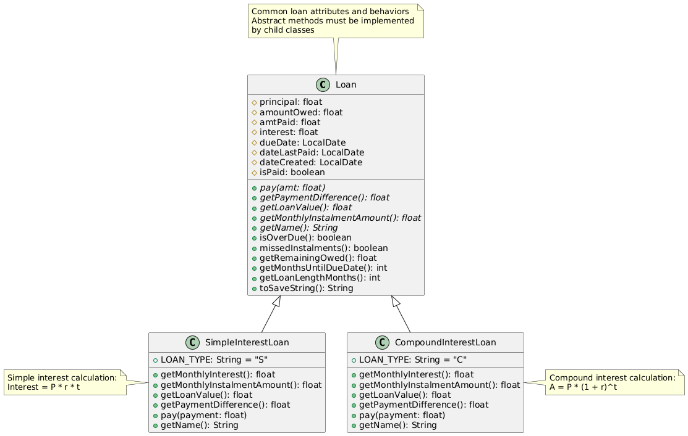

Given below is an example usage scenario and how the `loan` feature behaves at each step.

Step 1. The user adds a `Person` to Sharkives using an `add` command.

Step 2. The user uses the `loan` command to add a loan to that `Person` (e.g., `loan 1 s 1000.00 5.5 2030-12-31`).

Step 3. This input is read as a `loan` command, and the Ui creates a `LoanCommandParser` object with the args from the command.

Step 4. When `parse()` is called, it matches the args to a **validation regex**, which makes sure that the number of arguments and their format is as specified.

**Note:** Any malformed command causes a `ParserException` to be thrown, which informs the user that their format is wrong, and the correct usage of the command.

Step 5. Then, these args are split and passed to `LoanCommand`, which processes and stores these args.

Step 6. `execute()` in `LoanCommand` is called, which in turn creates a `Loan` object based on the provided args and then adds it to the specified person's `LoanList`.

**Design considerations:**
- Although the `add` command uses predicates (e.g. `n/`, `e/`), we elected not to use those as having too many predicates would be confusing to the user, and unnecessarily wordy for a relatively shorter command. In addition, none of these arguments are optional.
- As each person has a `has-a` relationship with loans, we modeled this by making `LoanList` a new field in each `Person`, which is initiated empty.

### Payment feature

#### Implementation

The Payment feature is facilitated by `LoanList`, as described previously. Additionally, it adds the following classes:
- `PayCommand`  —  a `Command` class that inherits from `Command` and implements all of its methods
- `PayCommandParser`  —  a `Parser` class that implements `Parser` and returns a `PayCommand`

The `PayCommand` class features an overloaded constructor which supports 3 different ways to pay for a loan - amount, months' worth of instalments, and all at once. A `pay` command (e.g., `pay 1 2 100.00`) is parsed by `PayCommandParser`, which chooses the appropriate constructor and returns a `PayCommand` object.

The below image illustrates the above relationship:

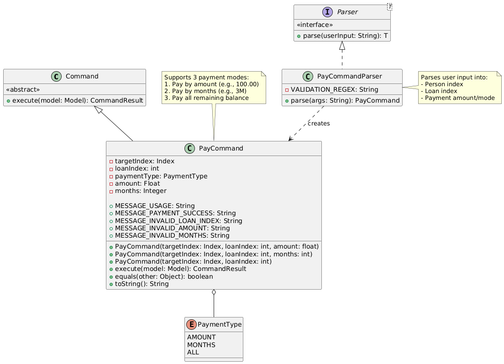

Given below is an example usage scenario and how the Pay feature behaves at each step.

Step 1. The user creates a `loan` (e.g., `loan 1 s 1000 5.5 2025-12-31`) for an existing `Person`, adding it to their `LoanList`.

Step 2. The loanee makes a payment, which is recorded by the user using the `pay` command (e.g., `pay 1 1 50.00`).

Step 3. The command is read and sent to `PayCommandParser`, which splits the arguments up. It then looks at the 3rd argument (i.e., `50.00`) and sees that it is a `float` that contains neither `M` or is `all`.

Step 4. `PayCommandParser` chooses the constructor of `PayCommand` that takes a `float` as the third argument, and returns the `PayCommand`.

Step 5. The `PayCommand` is executed, which looks at the first argument, the index of the loanee who paid, and calls the `pay()` method in their `Person` object. This in turn calls the `pay()` method in their `LoanList`, which gets the appropriate `Loan` (from the second argument) and pays the specified amount to it.

Step 6. Assuming no errors occur (such as the amount being more than the remainder owed), the amount is added to `amtPaid` field in the loan (instead of being deducted directly, which helps with flexible loan repayment calculations) and the remaining owed is updated based on the principal, interest rate, time passed, and amount already paid.

**Note:** If either index is out-of-bounds, `PayCommandParser` throws the corresponding `ParserException`. If the amount exceeds the amount remaining, `PayCommand` throws the corresponding `CommandException`.

**Note:** Other scenarios such as a malformed command or negative values is covered by the validation regex, which ensures that the command follows the specified format.

**Design considerations:**
- For Compound Interest, a flexible payment schedule (like the one we have implemented) greatly complicates calculations, as early payments can reduce principal earlier and thus overall interest, vice versa. In addition, allowing flexible payments can change the effective interest rate.
- **Proposed Extension:** allowing the user to choose between a fixed monthly plan and flexible repayment would be a future feature that could alleviate this problem.

### \[Proposed\] Undo/redo feature

#### Proposed Implementation

The proposed undo/redo mechanism is facilitated by `VersionedSharkives`. It extends `The Sharkives` with an undo/redo history, stored internally as an `SharkivesStateList` and `currentStatePointer`. Additionally, it implements the following operations:

* `VersionedSharkives#commit()` — Saves the current address book state in its history.

* `VersionedSharkives#undo()` — Restores the previous address book state from its history.

* `VersionedSharkives#redo()` — Restores a previously undone address book state from its history.

These operations are exposed in the `Model` interface as `Model#commitSharkives()`, `Model#undoSharkives()` and `Model#redoSharkives()` respectively.

Given below is an example usage scenario and how the undo/redo mechanism behaves at each step.

Step 1. The user launches the application for the first time. The `VersionedSharkives` will be initialized with the initial address book state, and the `currentStatePointer` pointing to that single address book state.

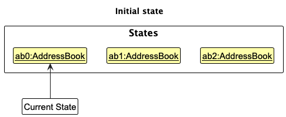

Step 2. The user executes `delete 5` command to delete the 5th person in the address book. The `delete` command calls `Model#commitSharkives()`, causing the modified state of the address book after the `delete 5` command executes to be saved in the `SharkivesStateList`, and the `currentStatePointer` is shifted to the newly inserted address book state.

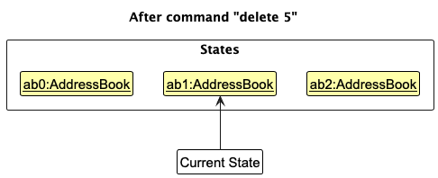

Step 3. The user executes `add n/David …​` to add a new person. The `add` command also calls `Model#commitSharkives()`, causing another modified address book state to be saved into the `SharkivesStateList`.

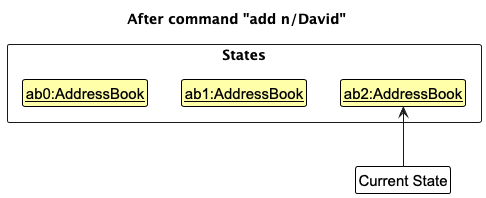

<box type="info" seamless>

**Note:** If a command fails its execution, it will not call `Model#commitSharkives()`, so the state will not be saved into the `SharkivesStateList`.

</box>

Step 4. The user now decides that adding the person was a mistake, and decides to undo that action by executing the `undo` command. The `undo` command will call `Model#undoSharkives()`, which will shift the `currentStatePointer` once to the left, pointing it to the previous state, and restores The Sharkives to that state.

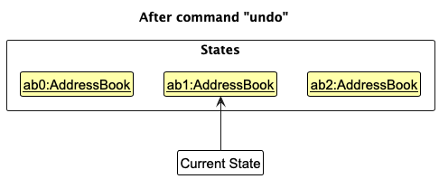

<box type="info" seamless>

**Note:** If the `currentStatePointer` is at index 0, pointing to the initial Sharkives state, then there are no previous Sharkives states to restore. The `undo` command uses `Model#canUndoSharkives()` to check if this is the case. If so, it will return an error to the user rather

than attempting to perform the undo.

</box>

The following sequence diagram shows how an undo operation goes through the `Logic` component:

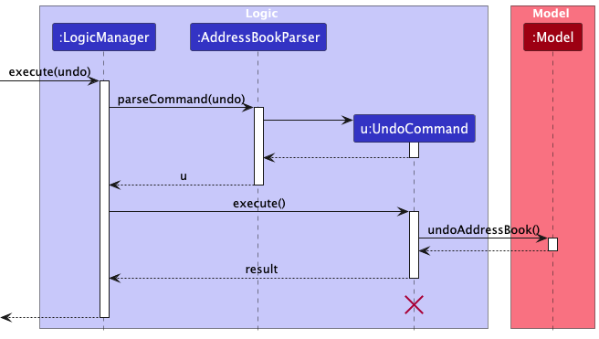

<box type="info" seamless>

**Note:** The lifeline for `UndoCommand` should end at the destroy marker (X) but due to a limitation of PlantUML, the lifeline reaches the end of diagram.

</box>

Similarly, how an undo operation goes through the `Model` component is shown below:

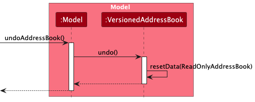

The `redo` command does the opposite — it calls `Model#redoSharkives()`, which shifts the `currentStatePointer` once to the right, pointing to the previously undone state, and restores the address book to that state.

<box type="info" seamless>

**Note:** If the `currentStatePointer` is at index `SharkivesStateList.size() - 1`, pointing to the latest address book state, then there are no undone Sharkives states to restore. The `redo` command uses `Model#canRedoSharkives()` to check if this is the case. If so, it will return an error to the user rather than attempting to perform the redo.

</box>

Step 5. The user then decides to execute the command `list`. Commands that do not modify the address book, such as `list`, will usually not call `Model#commitSharkives()`, `Model#undoSharkives()` or `Model#redoSharkives()`. Thus, the `SharkivesStateList` remains unchanged.

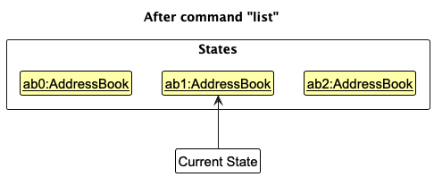

Step 6. The user executes `clear`, which calls `Model#commitSharkives()`. Since the `currentStatePointer` is not pointing at the end of the `SharkivesStateList`, all address book states after the `currentStatePointer` will be purged. Reason: It no longer makes sense to redo the `add n/David …​` command. This is the behavior that most modern desktop applications follow.

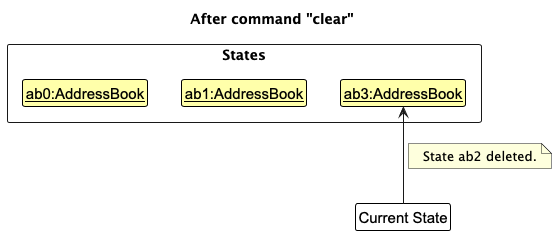

The following activity diagram summarizes what happens when a user executes a new command:

#### Design considerations:

**Aspect: How undo & redo executes:**

* **Alternative 1 (current choice):** Saves the entire address book.

  * Pros: Easy to implement.

  * Cons: May have performance issues in terms of memory usage.

* **Alternative 2:** Individual command knows how to undo/redo by

  itself.

  * Pros: Will use less memory (e.g. for `delete`, just save the person being deleted).

  * Cons: We must ensure that the implementation of each individual command are correct.

_{more aspects and alternatives to be added}_

[//]: # ()
[//]: # (### \[Proposed\] Data archiving)

[//]: # ()
[//]: # (_{Explain here how the data archiving feature will be implemented}_)

--------------------------------------------------------------------------------------------------------------------

## **Documentation, logging, testing, configuration, dev-ops**

* [Documentation guide](Documentation.md)
* [Testing guide](Testing.md)
* [Logging guide](Logging.md)
* [Configuration guide](Configuration.md)
* [DevOps guide](DevOps.md)

--------------------------------------------------------------------------------------------------------------------

## **Appendix: Requirements**

### Product scope

**Target user profile**:

* licenced moneylender with a significant number of clients
* needs to keep track of client contacts
* needs to keep track of clients' loans
* prefers desktop apps over other types
* prefers typing input on CLI to mouse interactions

**Value proposition**: manage client contacts and loans faster than a typical mouse/GUI driven app

### User stories

Priorities: High (must have) - `* * *`, Medium (nice to have) - `* *`, Low (unlikely to have) - `*`

| Priority | As a …​                        | I want to …​                                                                | So that I can…​                                           |
|----------|--------------------------------|-----------------------------------------------------------------------------|-----------------------------------------------------------|
| `* * *`  | new user                       | see usage instructions                                                      | refer to instructions when I forget how to use the app    |
|          | **Client Tracking**            |
| `* * *`  | licensed moneylender           | add a new person                                                            |                                                           |
| `* * *`  | licensed moneylender           | delete a person                                                             | remove entries that I no longer need                      |
| `* * *`  | ethical loanshark              | view client profiles                                                        | track client contact details                              |
| `* * *`  | ethical loanshark              | edit client profiles                                                        | keep records up to date                                   |
| `* *`    | ethical loanshark              | tag clients with labels                                                     | quickly identify and categorize them                      |
| `* *`    | ethical loanshark              | search clients by name, contact number, loan ID                             | quickly locate their records                              |
| `* *`    | ethical loanshark              | predict client risk                                                         | assess the risk of a new client                           |
| `* *`    | ethical loanshark              | archive inactive client profiles                                            | declutter active records while keeping history accessible |
| `*`      | ethical loanshark              | log time of reminders for each client                                       | have a record of communication                            |
| `*`      | ethical loanshark              | view a log of all reminders sent to a client                                | know when to schedule future reminders                    |
|          | **Loan Tracking and Analysis** |
| `* * *`  | ethical loanshark              | add loan by client                                                          | track when money is lent to a client loan                 |
| `* * *`  | ethical loanshark              | delete loan by client                                                       | track when a client pays their loan                   |
| `* * *`  | ethical loanshark              | view loans by client                                                        | track when a client pays their loan                       |
| `* * *`  | ethical loanshark              | edit loans                                                                  | update details as needed                                  |
| `* * *`  | ethical loanshark              | handle multiple interest calculation methods                                | use the most suitable one for each loan                   |
| `* *`    | ethical loanshark              | sort loans by priority                                                      | know which loans to chase                                 |
| `*`      | ethical loanshark              | generate a summary of all loans connected to a guarantor                    | assess their risk exposure                                |
| `*`      | ethical loanshark              | summarize outstanding loans, due dates, and overdue payments on a dashboard | have an overview of my business                           |
| `*`      | ethical loanshark              | view overdue payments as a percentage of total active loans                 | gauge my portfolio’s health                               |
| `*`      | ethical loanshark              | view repayment trends (weekly, monthly, yearly)                             | identify seasonal patterns in client payments             |
| `*`      | ethical loanshark              | apply discounts or waive fees in special cases                              | accommodate loyal clients or challenging situations       |
| `*`      | ethical loanshark              | compare repayment rates between loan types                                  | optimize my offerings                                     |
|          | **Related Party Management**   |
| `* *`    | ethical loanshark              | add related parties for each client                                         | categorize them as family, guarantors, or friends         |
| `* *`    | ethical loanshark              | track contact preferences of related parties                                | approach them respectfully                                |
| `* *`    | ethical loanshark              | store multiple contact methods for related parties                          | have options for reminders                                |
| `*`      | ethical loanshark              | identify the most responsive related party                                  | know who to contact first if necessary                    |
|          | **Data Management**            |
| `* * *`  | ethical loanshark              | save data locally at end of session                                         | keep record history from previous session                 |
| `* *`    | ethical loanshark              | import data                                                                 | ensure seamless onboarding of information                 |
| `* *`    | ethical loanshark              | export data                                                                 | share or back up information                              |
| `*`      | ethical loanshark              | purge all data                                                              | cleanse the system                                        |
| `*`      | ethical loanshark              | save data selectively (filter/sort)                                         | save only certain data                                    |
| `*`      | ethical loanshark              | log all data changes (e.g., updates to client profiles, loan terms)         | have a clear audit trail                                  |
| `*`      | ethical loanshark              | encrypt all data                                                            | ensure client data safety in the event of a leak          |

*{More to be added}*

### Use cases

(For all use cases below, the **System** is `The Sharkives` and the **Actor** is the `user`, unless specified otherwise)

**Use case UC01: Add a client**

**MSS**

1.  User requests to add a client and his details to the list
2.  The Sharkives adds the person

   Use case ends.

**Extensions**

* 1a. The given input is invalid
    * 1a1. The Sharkives shows an error message.

      Use case resumes at step 1

**Use case UC02: Delete a client**

**MSS**

1. User requests to delete a specific client in the list
2. The Sharkives deletes the client

      Use case ends.

**Extensions**

* 1a. The given index is invalid.
    * 1a1. The Sharkives shows an error message.

      Use case resumes at step 1.

**Use case UC03: Edit a client**

**MSS**

1.  User requests an amendment to an existing entry in the list
2.  The Sharkives updates the client details

      Use case ends.

**Extensions**

* 1a. The given index or client details are invalid.
    * 1a1. The Sharkives shows an error message.

      Use case resumes at step 1.

**Use case UC04: Add a loan for a client**

**MSS**

1. User requests to add a loan to a specific client in the list
2. The Sharkives adds a loan entry to the client

      Use case ends.

**Extensions**

* 1a. The given index or loan details are invalid.
    * 1a1. The Sharkives shows an error message.

      Use case resumes at step 1.

**Use case UC05: Delete a loan for a client**

**MSS**

1. User requests to delete a loan to a specific client in the list
2. The Sharkives removes the loan entry to the client

      Use case ends.

**Extensions**

* 1a. The given index of client or loan are invalid.
    * 1a1. The Sharkives shows an error message.

      Use case resumes at step 1.

**Use case UC06: Filter loans**

**MSS**

1. User requests to filter loans based on a specified predicate.
2. The Sharkives shows only the loans that fit the specified predicate.
3. User clears filter.
4. The Sharkives shows all the loans again in their default order.

    Use case ends.

**Extensions**
* 1a. The predicate specified is invalid.
  * 1a1. The Sharkives shows that it did not filter by any predicate, and maintains the default view.

    Use case resumes at step 1.

**Use case UC07: Sort loans**

**MSS**

1. User requests to sort by a parameter in a specified order.
2. The Sharkives sorts and orders the clients based on the parameter in the specified order.

    Use case ends.

**Extensions**

* 1a. The user neglects to specify any arguments.
  * 1a1. The Sharkives defaults to ordering the clients in descending order based on amount.

    Use case ends.

* 1b. The parameter or order is invalid.
  * 1b1. The Sharkives shows an error message.

    Use case resumes at step 1.

*{More to be added}*

### Non-Functional Requirements

1.  Should work on any _mainstream OS_ as long as it has Java `17` or above installed.
2.  Should be able to hold up to 1000 persons without a noticeable sluggishness in performance for typical usage.
3.  A user with above average typing speed for regular English text (i.e. not code, not system admin commands) should be able to accomplish most of the tasks faster using commands than using the mouse.

*{More to be added}*

### Glossary

* **Mainstream OS**: Windows, Linux, Unix, MacOS
* **Private contact detail**: A contact detail that is not meant to be shared with others
* **Simple Interest Loan**: A loan that accrues interest based on the principal only
* **Compound Interest Loan**: A loan that accrues interest based on the principal **and** any previously accrued interest.
* **Args**: Short-form for **arguments**, referring to the components of a `command` necessary for it to work as specified. These include parameters such as indices, and amount.

--------------------------------------------------------------------------------------------------------------------

### **Appendix: Instructions for Manual Testing**

Given below are instructions to test the app manually.

> **Note:** These instructions only provide a starting point for testers to work on.
> Testers are expected to do more *exploratory* testing.

---

### Launch and Shutdown

#### Initial Launch

1. Download the `.jar` file and place it in an empty folder.
2. Double-click the `.jar` file.
   **Expected:** The app launches with a sample list of persons. The window may not be optimally sized.

#### Saving Window Preferences

1. Resize and reposition the window to a new location.
2. Close the window and re-launch the `.jar` file.
   **Expected:** The most recent window size and location are retained.

---

### Deleting a Person

#### While all persons are shown

1. **Prerequisite:** Run the `list` command to display all persons. Ensure there are at least 2 persons in the list.
2. **Test case:** `delete 1`
   **Expected:** First person in the list is deleted. Status message displays deleted contact details. Timestamp updates.
3. **Test case:** `delete 0`
   **Expected:** No person is deleted. Error message is shown. Status bar remains unchanged.
4. **Test case:** `delete`
   **Expected:** Error message for missing index.
5. **Test case:** `delete x` (where `x` is larger than the list size)
   **Expected:** Error message for invalid index.

---

### Saving Data

#### Missing or Corrupted Data File

1. Locate the `data/AddressBook.json` file and rename/delete it while the app is closed.
2. Re-launch the app.
   **Expected:** A new data file is generated with sample data, or an appropriate error message is shown.
3. Alternatively, open `AddressBook.json` and modify it to an invalid JSON format (e.g., remove a closing brace).
4. Re-launch the app.
   **Expected:** App shows error message about corrupted data and starts with an empty dataset.

---

### Sort Command

1. **Test case:** `sort`
   **Expected:** List is sorted with overdue loans at the top, followed by others in descending order of loan amount.
2. **Test case:** `sort extraArg`
   **Expected:** Error message for invalid command format.

---

### FilterLoan Command

1. **Test case:** `filterLoan unpaid`
   **Expected:** Only persons with unpaid loans are displayed.
2. **Test case:** `filterLoan paid`
   **Expected:** Only persons with fully paid loans are displayed.
3. **Test case:** `filterLoan abc`
   **Expected:** Error message indicating invalid filter option.

---

### Loan Command

1. **Test case:** `loan 1 s 1000.00 5.5 2030-12-31`
   **Expected:** First person in list has a simple interest loan with principal `1000.00`, interest rate `5.5`, and due date `2030-12-31` added to their loan list.
2. **Test case:** `loan 1 c 1000.00 5.5 2030-12-31`
   **Expected:** First person in list has a compound interest loan with principal `1000.00`, interest rate `5.5`, and due date `2030-12-31` added to their loan list.
3. **Test case:** `loan 0 s 1000.00 5.5 2030-12-31`
   **Expected:** Error message: `Index is not a non-zero unsigned integer.`
4. **Test case:** `loan abc`
   **Expected:** Error message indicating invalid command format with correct usage.

---

### Pay Command

**Prerequisites**:
- At least one person in person list
- First person must have at least one loan (add via `loan 1 s 1000.00 5.5 2030-12-31` if needed)

1. **Test case:** `pay 1 1 100.00`  
   **Expected:**  
   - First loan of first person is reduced by $100.00  
   - Status message shows payment confirmation
   - Updated loan details visible in person's profile

2. **Test case:** `pay 1 1 2M`  
   **Expected:**
   - First loan is reduced by 2 months worth of payments
   - Detailed loan information shows updated installment schedule

3. **Test case:** `pay 1 1 all`  
   **Expected:**  
   - Loan is fully paid and removed automatically from the person's loan list
     
4. **Test case:** `pay 0 1 100.00`  
   **Expected:**  
   - Error: `Index is not a non-zero unsigned integer.`  
   - No changes to any loans

5. **Test case:** `pay 1 1 0.00`  
   **Expected:**  
   - Error: `The amount must be a positive number.`  
   - No balance changes

6. **Test case:** `pay 1 1 9999.00` (when balance < $9999)  
   **Expected:**  
   - Error: `Payment exceeds the remaining owed!`  
   - No balance changes

## **Appendix: Effort**

Our team of 5 spent significant effort extending the base AB3 functionality into a **financial loan tracking application**.

### Challenges:

- Implementing accurate logic for **compound vs. simple interest**, especially across multiple repayments
- Designing a flexible `Loan` model to support **filtering, sorting, payment tracking**
- Maintaining UI consistency while adding new fields (e.g., status, amounts)
- Managing state updates in `ModelManager` to ensure correct `ObservableList` behavior
- Designing UI to make sure home screen is not too cluttered while showing necessary information.

### Achievements:

- Built fully functional `loan`, `delete loan`, `pay`, `filterLoan`, and `sort` commands
- Enhanced UI responsiveness and modularity
- 0 reused code: All logic and data structures were built from scratch
- Edited existing code to fit our requirements
- Completely revamped and customized UI to fit our theme

---
